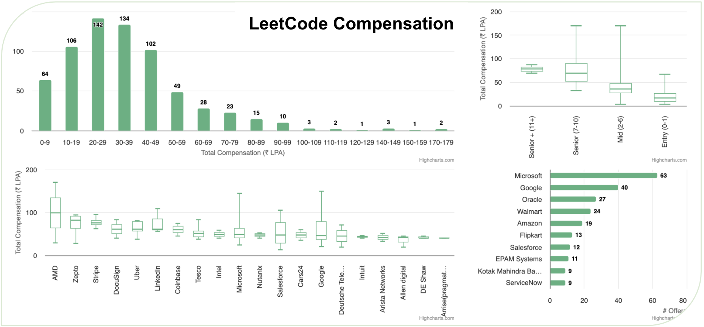

# leetcode compensation

[](https://github.com/kuutsav/leetcode-compensation/actions/workflows/data-refresh.yaml)
[](https://github.com/kuutsav/leetcode-compensation/actions/workflows/pages/pages-build-deployment)
[](https://github.com/psf/black)
[](http://mypy-lang.org/)

https://kuutsav.github.io/leetcode-compensation/

Analysing compensations mentioned on the Leetcode forums (only supports posts from `India` at the moment).

- The data is updated bi-weekly via a GitHub action that creates a PR with the latest data.
- We filter out posts with negative votes so we add a 2-day lag in data refresh to allow votes to come in.
- The `leetcomp` directory contains scripts to fetch new posts from [leetcode.com/discuss/compensation](https://leetcode.com/discuss/compensation).
- We use LLMs to parse structured information from the scraped posts, which is then sanitised and aggregated.

---



## Getting Started

Install uv with our standalone installers, or from [PyPI](https://pypi.org/project/uv/):

```shell
# On macOS and Linux.
curl -LsSf https://astral.sh/uv/install.sh | sh

# On Windows.
powershell -c "irm https://astral.sh/uv/install.ps1 | iex"

# For a specific version.
curl -LsSf https://astral.sh/uv/0.2.9/install.sh | sh
powershell -c "irm https://astral.sh/uv/0.2.9/install.ps1 | iex"

# With pip.
pip install uv

# With pipx.
pipx install uv

# With Homebrew.
brew install uv
```

To create a virtual environment:

```shell
uv venv  # Create a virtual environment at .venv.
```

To activate the virtual environment:

```shell
# On macOS and Linux.
source .venv/bin/activate

# On Windows.
.venv\Scripts\activate
```

To install a package into the virtual environment:

```shell
uv pip install -r requirements.txt  # Install from a requirements.txt file.
```

## Updating data

> Make sure you are in a venv with all the packages installed and have llm inference setup (look at the llms section of config.toml) using any of the supported options like ollama(local), vllm(local), openrouter(api)

```bash
$ export PYTHONPATH=.
$ python leetcomp/refresh.py
$ python leetcomp/parse.py
```

## Roadmap

- [x] Sort by Compensation and Yoe
- [x] Filters for Yoe, Compensation
- [x] Add pagination
- [x] Search for Companies and Locaations

## Contributions

PRs are welcome but please go through [CONTRIBUTING.md](CONTRIBUTING.md) before raising a PR.
